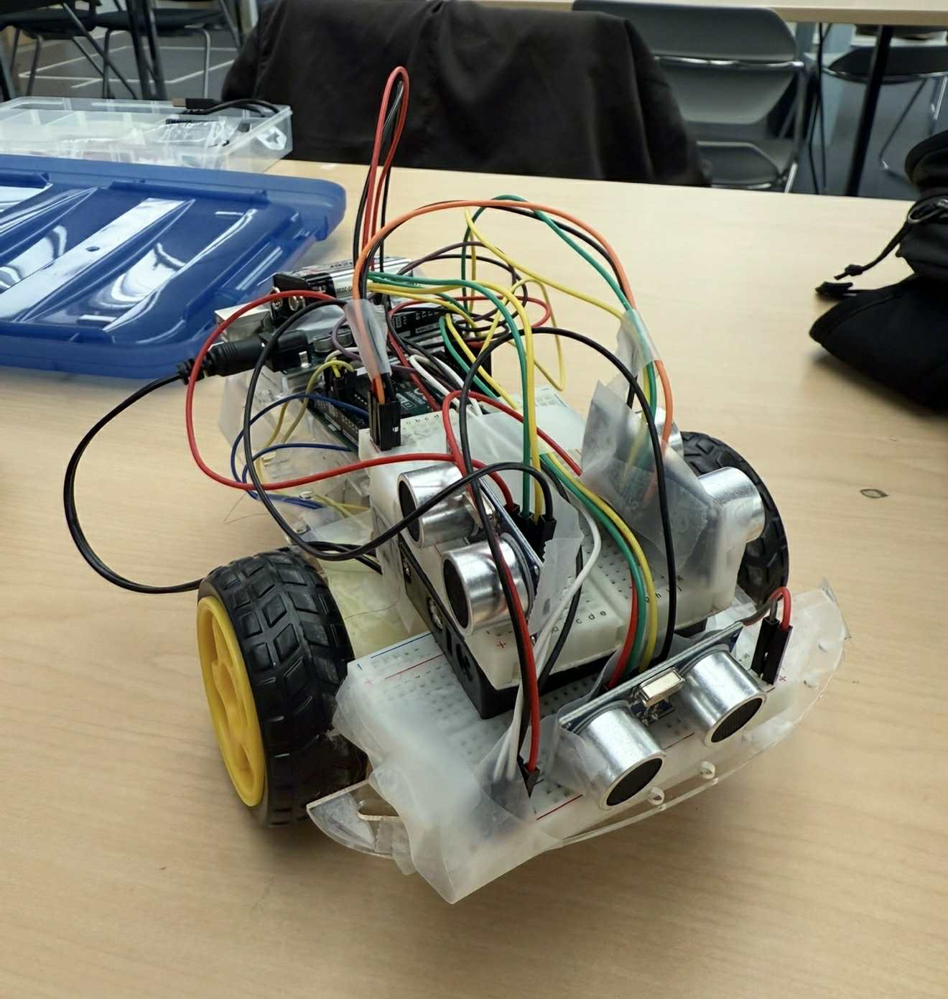

<h1 align="center">Arduino Tournament Robot</h1>

<h4 align="center">
  An autonomous Arduino robot designed to navigate a tournament maze  
  with line, wall, and object detection capabilities.
</h4>

## Contributors
- Eno Chen
- Jianding Bai
- Stephanie Xue

 

## Table of Contents
- [Overview](#overview)
- [Features](#features)
- [Demos](#demos)
- [Tech Stack](#tech-stack)
- [How It Works](#how-it-works)
- [Future Improvements](#future-improvements)

 

## Overview
This project involved building an autonomous Arduino robot that is able to complete a three part tournament maze consisting of a line following section, a wall following maze, and an object detection arena. The robot begins by tracking a taped line across the floor, transitions into following the walls of a maze once it reaches the end of the line, and finally enters a designated arena where it must locate and approach a target object to complete the course. The robot was built with an Arduino Uno as the central microcontroller, two DC motors mounted on wheels for movement, two photoresistors for line detection, and three HC-SR04 ultrasonic sensors for wall following and object detection, all wired together on a breadboard. The robot is programmed in C++ through the Arduino IDE. The robot automatically switches between line following, wall following, and object detection based on the sensor readings, without requiring manual input between the different sections.

 

## Features

### Line Following
Two photoresistors mounted on the underside of the robot read the difference in reflected light between a white line and the surrounding floor, using threshold comparisons to detect the boundary between the line and the floor. The robot compares the left and right sensor values each loop to decide whether to drive straight, turn left, or turn right, and falls back to a short search routine if neither sensor detects the line.

### Wall Following
Three HC-SR04 ultrasonic sensors, one facing forward and one on each side, measure distance to the wall in front of and beside the robot, with a running average filter smoothing out noisy readings between loop iterations. The robot follows along the wall at a set distance and detects corners by comparing the front reading against a set threshold, then turns toward whichever side has more open space.

### Object Detection
Once the robot leaves the wall following maze and crosses into the object detection arena, it uses the same three ultrasonic sensors to detect the target object directly in front or to either side and drives toward it, closing the distance until it is close enough to touch and stops permanently. If nothing is detected nearby, the robot performs a 360 degree sweep, rotating in small increments and re-measuring distance at each step. The robot also watches for the white boundary line of the arena to avoid driving out of bounds during the sweep.

### Automatic Mode Switching
The robot moves through line following, wall following, and object detection as a single state machine. Each mode watches for a specific sensor condition, a wall coming into range, a white line reappearing, that signals it is time to transition to the next stage, so the whole course runs without needing to restart the program between sections.

 

## Demos

**Line and Wall Following Demo**

https://github.com/user-attachments/assets/71704a0d-487c-44ef-b94b-34d043847bef

**Object Detection Demo**

https://github.com/user-attachments/assets/91f83e64-d642-4e0a-b90d-ed55b0a2c52d

 

## Tech Stack

| Category | Details |
|---|---|
| Language | C++ |
| Microcontroller | Arduino Uno, programmed through the Arduino IDE |
| Sensors | Photoresistors (detect the white line for line following), HC-SR04 ultrasonic sensors (measure distance for wall following and object detection) |
| Motors | DC motors (drive the wheels) |
| Wiring | Breadboard (connects the microcontroller, motors, and sensors together) |

 

## How It Works
The robot runs on an Arduino Uno with two DC drive motors, each controlled through a pair of direction and speed pins (pins 8 and 9 for the left motor, pins 4 and 5 for the right motor), allowing each side to be driven forward, backward, or stopped independently. Sensing is split across two systems, two photoresistors mounted on the underside of the chassis for line detection, and three HC-SR04 ultrasonic sensors, one mounted facing forward and one on each side, for measuring distance during wall following and object detection.

Every loop starts by reading both photoresistors and triggering all three ultrasonic sensors, timing the echo pulse on each to calculate distance in centimeters. Because ultrasonic readings can spike or drop out unpredictably from one reading to the next, each of the three distance values is passed through a running average filter that blends the current reading with the previous one before it is used for any decision. This is a lightweight smoothing method, it does not eliminate noise the way a longer moving average or a Kalman filter would, but it is enough to prevent single bad readings from triggering an incorrect turn or corner detection. The photoresistor readings are used directly for line detection without this averaging step, since their values change less erratically and the threshold comparisons between the two sensors already provide enough stability.

Depending on which mode is active, the robot then hands these filtered readings off to one of three behaviors. In line following mode, it compares the left and right photoresistor values against fixed white line thresholds and against each other, driving straight when both sensors read the floor, turning toward whichever side reads a brighter value when the line is off to one side, and running a short search routine if neither sensor is currently over the line. Once any of the three ultrasonic sensors detects a wall within range, the robot switches into wall following mode, where it drives forward at a fixed speed while the front sensor watches for an upcoming corner. When the front distance crosses the corner threshold, the robot compares the left and right side readings and turns toward whichever side has more open space. When the photoresistors detect a white line again, marking the transition out of the wall maze, the robot switches into object detection mode, drives forward into the arena, and begins checking the three ultrasonic sensors for the target object directly ahead or to either side. If nothing is found nearby, it performs a 360 degree sweep in small rotational steps, re-checking all three sensors and the photoresistors at each step so it can both find the object and avoid crossing back over the arena boundary, and stops permanently once it closes to within a few centimeters of the object.

 

## Future Improvements
- Add a calibration routine at startup to automatically tune the white line thresholds to the current lighting conditions instead of using fixed values
- Add more sensors or upgrade to higher quality infrared distance sensors for more precise wall and object detection
- Replace the three fixed ultrasonic sensors with a single rotating ultrasonic sensor mounted on a servo for a continuous 360 degree sweep
- Add wireless data logging over Bluetooth or WiFi to stream sensor readings in real time instead of relying on the Serial Monitor over USB